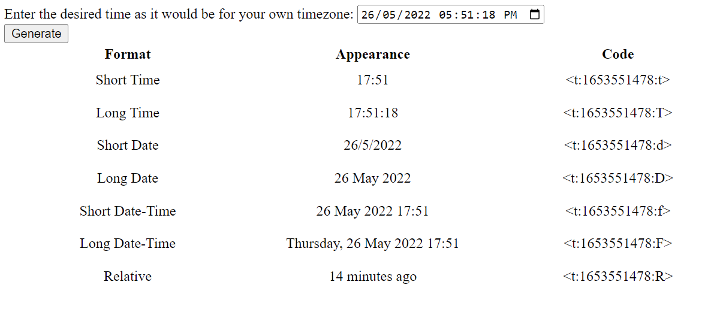

# Discord Timestamp Generator

Lil demo project to show how JavaScript can be used to generate Discord timestamp snippets.

Should look like this:

[Demo website available here.](https://alexanderstormwood.com/DiscordTimestampGenerator/src/index.html)
